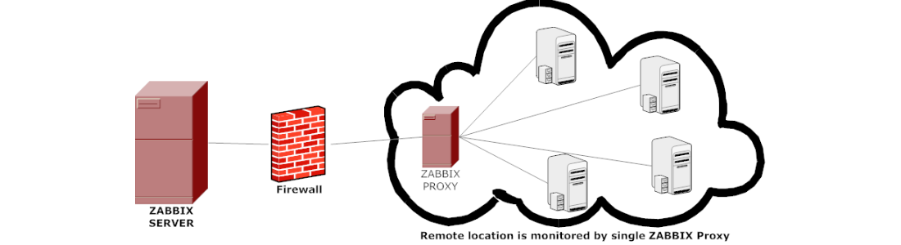

# Запускаем Zabbix. Переходим на контейнеры: быстрый старт, экономия ресурсов и крепкий сон


Всем привет!  Меня зовут Сергей, я внедряю и сопровождаю мониторинг, вот уже пару лет. Написал “буклет”, где ты читатель найдешь вводную информацию о технологиях, и практический пример внедрения системы мониторинга Zabbix по типу “полный дом”. Можно запустить все компоненты или выбрать нужные, а можно запустить компоненты на разных машинах в кластере, и после запуска компоненты готовы к работе. Своей целью я поставил быстрое и простое внедрение мониторинга, с экономией ресурсов, и отказоустойчивостью, получилось или нет? Читай ниже и запускай 

# Оглавление <!-- omit in toc -->
<!-- TOC -->
- [Виртуализация](#Виртуализация)
- [Микрослужбы](#Микрослужбы)
- [Контейнеры](#Контейнеры)
- [Zabbix](#Zabbix)
- [Окружение](#Окружение)
    - [Установка Docker](#Установка-Docker)
- [Проект](#Проект)
- [Переменные окружения](#Переменные-окружения)
    - [База данных Zabbix](#База-данных-Zabbix)
    - [Система поиска Elasticsearch](#Система-поиска-Elasticsearch)
    - [Сервер Zabbix](#Сервер-Zabbix)
    - [Прокси-сервер Zabbix](#Прокси-сервер-Zabbix)
    - [Веб-сервер Zabbix](#Веб-сервер-Zabbix)
    - [Агент Zabbix](#Агент-Zabbix)
    - [Шлюз Java Zabbix](#Шлюз-Java-Zabbix)
    - [SNMP-ловушка Zabbix](#SNMP-ловушка-Zabbix)
    - [Веб-сервис Zabbix](#Веб-сервис-Zabbix)
    - [Прокси-сервер Nginx](#Прокси-сервер-Nginx)
    - [Панели визуализации](#Панели-визуализации)
- [Запускаем Zabbix](#Запускаем-Zabbix)
- [Прокси Zabbix](#Прокси-Zabbix)
- [Прокси-Nginx](#Прокси-Nginx)
- [Elasticsearch](#Elasticsearch)
- [Kibana](#Kibana)
- [Grafana](#Grafana)
- [Запускаем кластер Zabbix](#Запускаем-кластер-Zabbix)
- [Итоги](#Итоги)

# Виртуализация
Технология виртуализации сегодня стандарт в любом производстве, много написано статей, книг, сделано роликов, поэтому опишу кратко. Виртуализация позволяет разделить и изолировать ресурсы компьютера, запуская виртуальные экземпляры машин управляемых гипервизором. Гипервизор - это программа которая управляем всеми вычислительными, сетевыми ресурсами и ресурсами хранения компьютера. Возможность разграничивать ресурсы компьютера, позволяет эффективнее использовать ресурс машины в производстве. У меня есть отдельная машина, там есть операционная система в которой работает база данных, и базе данных не нужны все мощности, она отлично работает с каким то своим условным набором, а остальные простаивают. Разделив ресурсы можно установить еще одну операционную систему, а внутри нее еще базу данных, веб-сервер и т.д. Исторически, сложилось 3 типа: полная, пара и контейнеризация. Полная и пара подойдут под пример выше, эти типы имеют свои детальные особенности, под свои условия, о них говорить не буду, больше о контейнеризации. Контейнеризация - представляет более легковесный и гибкий способ внедрения приложений, позволяет запускать процессы на машине как изолированные контейнеры, используя общую систему и ядро машины. При общепринятом подходе для внедрения сервиса предоставляется отдельная машина, контейнеризация идет вперед и отходит от общепринятого подхода, переходя в изолированную структуру которую относят к микрослужбам.

# Микрослужбы


Что такое микрослужба? Это независимые развернутые службы (процессы), которые общаются между собой по сети, делают систему распределенной и нейтральной к технологиям. Громкое слово `“Независимая”` - это изолировать, развернуть, изменять без посторонней зависимости. `“Распределенная”` -  когда компоненты системы, разбросаны по сетевым адресам, общаются между собой и могут быть запущены на разных машинах. `“Нейтральность к технологиям”` - можно варьировать выбором технологий, стилями программирования, базы данных в поисках правильной схемы и т.д. ведь все запускается в изолированном контейнере. Перед нами открываются новые возможности по внедрению и сопровождению служб.

Если тебя, как и меня читатель двигают идеи о движении к передовому внедрению то книги: Сэм Ньюмен, `“От монолита к микросервисам”` и `“Ускоряйся. Наука DevOps”` от Джез Хамбл, Джин Ким будем отличным дополнительным источникам получения идей. Я не смогу в краткой форме изложить всю суть, вместо этого я попробую тебя "зацепить" :)

Сэм Ньюмен в книге `"От монолита к микросервисам"` пишет: `"Независимая природа развертываний открывает новые модели повышения масштаба и робастности систем, а также позволяет комбинировать и сочетать технологии"`. 
Создаем систему в изолированной среде, которую можно масштабировать, автоматизировать и сочетать технологии. А если я уже хочу это делать с чего начать? Сначала организационные преобразования, вот о каких пишет Сэм Ньюмен, цитата: `Трехъярусная архитектура универсальна и общепринята, она основана на способе организации наших групп разработки. Мы группируем людей на основе их стержневых компетенций, поэтому мы создаем IT-активы. Указанный факт объясняет почему трехъярусная архитектура распространена, она не плохая но она группирует людей вокруг дружеских отношений. Силы и стремления изменились, мы хотим осуществлять доставку софта гораздо быстрее, чем когда прежде, теперь объединяем людей в поликвалифицированные группы. Владельцы продуктов теперь работают непосредственно в рамках групп доставки, причем эти группы выравниваются на клиента, теперь норма существование любой центральной ИТ-функции заключается в поддержке групп доставки, ориентированных на клиента.` 

Сэм Ньюмен продолжает дальше: `Как продать микрослужбы своему боссу?` Цитата: “Восьмиступенчатый процесс Джона Коттера”. Отправляем в "путешествие" с автором и получаем 8 пунктов: 

- `Закрепление необходимости`
- `Создание направляющей коалиции`
- `Развитие видения и стратегии`
- `Коммуницирование видения перемен`
- `Расширение полномочий сотрудников`
- `Краткосрочные победы`
- `Сбор и концентрация дополнительных изменений`
- `Бросаем якорь, клич в новом подходе в культуре`

Профессор Коттер знает о чем говорит, управляя кафедрой в Гарвардской школе бизнеса. 

Иду дальше в книге `Ускоряйся. Наука DevOps` от Джез Хамбл, Джин Ким я познакомился с Законом Конвея: `Любая организация, которая строит дизайн системы, сделает дизайн, структуру которого является копией коммуникационной структуры организации.` Он дал мне более общие понимание движения и изменения, какая коммуникация внутри своей организации, такой дизайн системы или нет? Приглашаю тебя читатель сесть за хорошие книжки. 

Теперь о контейнерах.

# Контейнеры


Суть контейнерных технологий в создании изолированных сред для запуска служб и их зависимостей. Контейнер можно упаковать в файл вместе с его зависимостями, библиотеками и другими необходимыми компонентами, и запустить их в изолированном окружении. Разработчик Zabbix уже выпустили все что необходимо, для запуска мониторинга на контейнерных технологиях, их я буду использовать. Контейнерных технологий сегодня много, но благодаря платформе Docker процесс упаковки приложения, библиотек и файловой системы стал проще. Docker также позволяет переносить контейнеры на разные машины в виде пакета, где есть контейнерный движок. Конечно есть и другие, таблица по технологиям тебе в помощь. Внедрение и разработка контейнеров объединяет людей платформой, превращаясь в стандарт для разработки и сопровождения. Если не работал с платформой Docker, то рекомендую книгу "Docker на практике" от Эйдан Хобсон, Иан Милл, и документацию. Платформа представляет из себя клиент-серверное взаимодействие, где пользователь - это клиент, а сервер - демон Docker, клиент отправляет команды, а демон их выполняет. Общая структура взаимодействия такая: у меня есть Dockerfile - файл с инструкциями для создания изображения (Docker image), Docker Image - это файл(пакет), который и создаст наш контейнер, как файл (пакет) его можно хранить как локально так и удаленно в репозитории (regestry) Docker. Контейнер (containers) Docker - это готовый к запуску изолированный процесс(ы). C платформой и демоном можно работать удаленно, шифровано - взаимодействие по протоколу HTTP. У платформы есть инструменты которые я и буду использовать.Например Docker-Compose - это инструмент для определения и запуска много контейнерных Docker-служб. С помощью Docker-Compose ты можешь объединить несколько контейнеров в приложение, определить зависимости между контейнерами, настроить параметры контейнеров, а потом ими управлять как единым целым. Файл конфигурации Docker-Compose, обычно называемый docker-compose.yml или ompose.yml,содержит описание всех необходимых контейнеров, услуг, сетей и томов для запуска приложения, и позволяет определить различные параметры и настройки для каждого контейнера, такие как образы, порты, переменные окружения, сети и т. д. После создания файла конфигурации, ты можешь использовать команды Docker-Compose для управления своими много контейнерными приложениями, такими как запуск, остановка и перезапуск, масштабирование служб, просмотр журналов и тд. Это значительно упрощает управление и развертывание много контейнерных приложений, обеспечивая простой и однородный способ определения и управления контейнерами. Тут думаю все, теперь о мониторинге.

# Zabbix

Рекомендую книжку `"Zabbix. Практическое руководство"` Андреа Далле Вакке, как хороший старт, здесь я дам краткое описание, а более детальнее лучше открыть [документацию.](https://www.zabbix.com/documentation/6.0/ru/manual) 

Zabbix — это свободное программное обеспечение для мониторинга сети, серверов, виртуальных машин, приложений, сервисов, баз данных, облачных сред и т.д. 


ПО имеет клиент-серверную архитектуру, состоящая из компонентов: `Веб-интерфейса`, `сервера Zabbix`, `базы данных Zabbix`, `агента Zabbix`. Есть еще второстепенные компоненты, которые позволяют расширить мониторинг, а именно: `система поиска Elasticsearch`, `шлюз Java Zabbix`, `ловушка SNMP Zabbix`, `веб-сервис (отправка отчетов) Zabbix`. Сервер Zabbix отвечает за сбор, и анализ данных мониторинга. Агенты Zabbix которые устанавливаются на отслеживаемых устройствах передают данные о состоянии системы на сервер Zabbix. Это данные об использовании CPU, памяти, дисков, сетевой трафик, работа сервисов и процессов. Связь между агентом и сервером идет по протоколу TCP/IP, позволяет передавать разнообразные типы данных: числовые значения, текстовые значения, символьные значения и т.д. У протокола есть механизм шифрования и аутентификации а значит и данные будут идти целыми и конфиденциальными. Данные будем как передавать, так и хранить. База данных Zabbix - она будет хранить данные, по умолчанию у нас огромный выбор для своих условий, я буду использовать [расширение TimescaleDB](https://www.zabbix.com/documentation/current/ru/manual/installation/requirements) для PostgreSQL. За всеми данными удобно наблюдать и строить мониторинг из веб-интерфейса Zabbix. Шлюз Java Zabbix - это такая точка входа для данных по протоколу JMX, с сервера Java. SNMP-ловушка - это механизм, который используется для получения активных уведомлений и информации о событиях от устройств, поддерживающих протокол SNMP (Simple Network Management Protocol). Веб-сервис Zabbix - это процесс по отправке отчетов по расписанию через электронную почту, отчет представляет собой файл PDF. Остался еще один компонент - Zabbix-прокси, о котором будет ниже. Оповещение событий, имеет гибкий механизм, который можно настраивать на уведомления практически на любое событие. Например, задачу в Jira, сообщение через E-mail, сообщение в Telegram. Такой подход позволяет быстро получить информацию в канал связи и реагировать на проблемы. Всё остальные какие то детали можно узнать из книги `"Zabbix. Практическое руководство"` Андреа Далле Вакке, или в [документации](https://www.zabbix.com/documentation/6.0/ru/manual). С вводными технологиями и все, приступим к развертыванию, но сначала об окружении.

# Окружение

Мои рекомендуемые требования: Машина 4 ядра и больше, 8 и больше гигабайт оперативной памяти, 50 гигабайт и больше свободного места на диске, и Oracle Linux (RHEL). Этот обьем ресурсов нужен для запуска всех комопнентов. Доступные порты для запуска сервисов, [можно найти здесь](https://www.zabbix.com/documentation/6.0/ru/manual/installation/requirements#%D1%81%D0%B5%D1%80%D0%B2%D0%B5%D1%80-%D0%BF%D1%80%D0%BE%D0%BA%D1%81%D0%B8). Системные компоненты обновлены до актуального состояния. Платформа Docker требует, чтобы машина была с актуальными обновлениями в [соответствии с ее документацией](https://docs.docker.com/). Поэтому смело обновляем систему и ее компоненты, а работать мы будем с платформой. При обновлении ядра системы в исключительных случаях платформа без сильна, но это редкие случаи. Для реализации нам нужен пользовать - администратор, root можно отключить, и быть в группе sudo. Настройка сети с внешним доступом, тут я использую сетевой мост, или сеть NAT. Брандмауэр и [SeLinux остается включенным](https://access.redhat.com/documentation/en-us/red_hat_enterprise_linux/8/html-single/using_selinux/index). По умолчанию в RedHat механизм SeLinux включен, и при настройке платформы Docker будут загружены политика SeLinux и брандмауэра, и этого достаточно, чтобы контролировать работу платформы, сетевого взаимодействия, не углубляясь в детали.

#### Установка Docker

Docker позаботилась о своих новых пользователях (менеджера пакетов apt) и предлагает установку в одну команду:

```sh
curl https://get.docker.com | sh
```
Файл [installdocker_dnf](/install_docker_dnf), для запуска c пакетным менеджером dnf/yum

```sh
#!/bin/bash
dnf update
dnf install -y yum-utils
yum-config-manager --add-repo https://download.docker.com/linux/centos/docker-ce.repo
dnf install -y docker-ce docker-ce-cli containerd.io docker-buildx-plugin docker-compose-plugin
systemctl enable docker.service
systemctl start docker
docker version
docker compose version
exit
```

Ждем установку, как только на экране будет вывод версии платформы и инструмента - платформа и инструменты готовы. Команды для взаимодействия с платформой должны быть запущены привилегированным пользователем и тут можно внести своего пользователя в группу docker, и тогда при написании команд, не нужно будет писать sudo. После внесения своего пользователя в группу docker нужна перезагрузка машины. Вносим своего пользователя в группу docker:

```sh
sudo usermod -aG docker $user
```
`$user - твой пользователь`

Окружение готово, платформа установлена теперь переходим к проекту внедрения.

# Проект

Вернемся к платформе Docker. Будем использовать каталоги проектов - это наборы файлов, директорий и настроек для запуска и управления контейнерами в Docker, например: файл конфигурации compose.yml, директория как том, или файл переменной окружения, вот так всё необходимое лежит в одном месте. С помощью файла [project](/project) создам в каталоге проекта zbx, директории, файлы переменных окружения. Далее я перейду к описанию и наполнению переменных окружения, и подготовлю код для запуска. Файл конфигурации .ylm должен быть написан на языке разметки YALM, по подробнее [здесь.](https://yaml.org) Язык разметки имеет ключ: значение. Каждый блок будет разбит на свою службу, и в каждой службе я обозначу всё необходимое для запуска. Конфигурация гибкая, запустить можно как все или выборочные службы.

# Переменные окружения

#### База данных Zabbix

Данные будут тут: zbx/env_vars/env_db

 | Переменная               | Описание                                                                                   |
|-------------------------|---------------------------------------------------------------------------------------------|
| DB_SERVER_HOST          | Эта переменная представляет собой IP- или DNS-имя сервера PostgreSQL. По умолчанию значение — «POSTGRES-SERVER». |
| DB_SERVER_PORT          | Эта переменная является портом сервера PostgreSQL. По умолчанию значение равно «5432».               |
| POSTGRES_USER           | Имя пользователя для подключения к базе данных PostgreSQL. По умолчанию — zabbix.                 |
| POSTGRES_USER_FILE      | Путь к файлу, содержащему имя пользователя для подключения к базе данных PostgreSQL.            |
| POSTGRES_PASSWORD       | Пароль пользователя для подключения к базе данных PostgreSQL. По умолчанию — zabbix.               |
| POSTGRES_PASSWORD_FILE  | Путь к файлу, содержащему пароль пользователя для подключения к базе данных PostgreSQL.           |
| POSTGRES_DB             | Имя базы данных Zabbix. По умолчанию — zabbix.                                                |
| DB_SERVER_SCHEMA        | Название схемы базы данных на сервере.                                                        |
| ENABLE_TIMESCALEDB      | Переменная, указывающая на необходимость включения расширения TimescaleDB для базы данных.        |
| POSTGRES_USE_IMPLICIT_SEARCH_PATH | Переменная, указывающая, следует ли использовать неявный поиск пути в PostgreSQL. Если установлено на "FALSE", база данных PostgreSQL не будет использовать неявный поиск пути для поиска объектов базы данных. Это может быть полезно для того, чтобы избежать путаницы и конфликтов при работе с объектами в разных схемах. |

#### Система поиска Elasticsearch

Переменные для запуска, я определил в самом блоке кода. Ниже будет их описание, это не все переменные, но их достаточно для запуска сервиса.

 | Переменная            | Описание                                                                                   |
|----------------------|---------------------------------------------------------------------------------------------|
| CLUSTER.NAME          | Наименование кластера Elasticsearch.                                                           |
| NODE.NAME            | Имя узла (ноды) в кластере Elasticsearch, можно указать IP-адрес и порт.                            |
| CLUSTER.INITIAL_MASTER_NODES | Перечень узлов, которые будут выступать в качестве первичных мастер-узлов кластера. |
| TRANSPORT.HOST        | IP-адрес, к которому привязывается транспортная служба Elasticsearch. Установлено значение "0.0.0.0" для прослушивания всех интерфейсов. |
| INGEST.GEOIP.DOWNLOADER.ENABLED | Определяет, включен ли загрузчик географических данных для обработки данных геолокации. Установлено значение "FALSE" для отключения данной возможности. |

#### Сервер Zabbix

Данные будут тут: zbx/env_vars/env_zbxsrv

 | Переменная                | Описание                                                                                   |
|---------------------------|---------------------------------------------------------------------------------------------|
| ZBX_ALLOWUNSUPPORTEDDBVERSIONS | Указывает, разрешено ли использование несовместимых версий базы данных. Параметр доступен с версии 6.0.0. |
| ZBX_DBTLSCONNECT           | Параметр, предположительно, предназначен для настройки подключения к базе данных с использованием TLS. Доступен с версии 5.0.0. |
| ZBX_DBTLSCAFILE            | Переменная, которая, вероятно, указывает путь к файлу сертификата центра сертификации при использовании TLS для подключения к базе данных. Доступна с версии 5.0.0. |
| ZBX_DBTLSCERTFILE          | Возможно, это переменная, задающая путь к файлу сертификата для подключения к базе данных с использованием TLS. Доступна с версии 5.0.0. |
| ZBX_DBTLSKEYFILE           | Вероятно, определяет путь к файлу ключа для подключения к базе данных с использованием TLS. Доступен с версии 5.0.0. |
| ZBX_DBTLSCIPHER           | Предположительно, устанавливает используемый шифр для TLS-соединения с базой данных. Доступен с версии 5.0.0. |
| ZBX_DBTLSCIPHER13          | Возможно, указывает на использование шифра TLS 1.3 для соединения с базой данных. Доступен с версии 5.0.0. |
| ZBX_VAULTDBPATH            | Переменная, предположительно, задающая путь к базе данных Vault. Доступна с версии 5.2.0. |
| ZBX_VAULTURL               | Указывает URL-адрес для подключения к сервису управления секретами Vault. Доступен с версии 5.2.0. |
| VAULT_TOKEN               | Предположительно, переменная, содержащая токен для аутентификации в сервисе управления секретами Vault. |
| ZBX_LISTENIP          | Устанавливает IP-адрес, на котором будет слушать сервер на предмет новых подключений. По умолчанию 0.0.0.0 означает, что сервер будет прослушивать все доступные IP-адреса на системе. |
| ZBX_LISTENPORT       | Устанавливает порт, на котором будет слушать сервер на предмет входящих подключений. В данном случае, сервер будет прослушивать порт 10051. |
| ZBX_LISTENBACKLOG    | Переменная, используется для установки максимальной длины очереди ожидающих соединений для прослушивания сокета. По умолчанию это значение зависит от операционной системы. Если параметр не установлен, его значение будет соответствовать уровню операционной системы. |
| ZBX_STARTREPORTWRITERS | Устанавливает количество запущенных процессов записи отчетов. Параметр доступен с версии 5.4.0. |
| ZBX_WEBSERVICEURL    | HTTP://zbxserver:10053/report - Устанавливает URL-адрес веб-сервиса для получения отчетов. Параметр доступен с версии 5.4.0. |
| ZBX_SERVICEMANAGERSYNCFREQUENCY | Предположительно, определяет частоту синхронизации менеджеров служб (например, дискавери и прокси) в секундах. Параметр доступен с версии 6.0.0. |
| ZBX_HISTORYSTORAGEURL | Переменная, вероятно, используется для указания URL-адреса хранилища истории. Параметр доступен с версии 3.4.0. |
| ZBX_HISTORYSTORAGETYPES | Устанавливает типы данных, хранящиеся в истории, включая целые числа, числа с плавающей запятой, строки, логи и текст. Параметр доступен с версии 3.4.0. |
| ZBX_STARTPOLLERS     | Устанавливает количество запущенных процессов опроса. В данном случае, будет запущено 5 процессов опроса. |
| ZBX_STARTCONNECTORS    | Устанавливает количество запущенных процессов коннекторов. Параметр доступен с версии 6.4.0. |
| ZBX_STARTPREPROCESSORS  | Устанавливает количество запущенных процессов предварительной обработки. Параметр доступен с версии 3.4.0. |
| ZBX_STARTPOLLERSUNREACHABLE | Устанавливает количество запущенных процессов опроса для недоступных узлов. В данном случае, будет запущен 1 процесс опроса недоступных узлов. |
| ZBX_STARTTRAPPERS       | Устанавливает количество запущенных процессов передатчиков. В данном случае, будет запущено 2 процесса передатчиков. |
| ZBX_STARTPINGERS       | Устанавливает количество запущенных процессов пингеров. В данном случае, будет запущен 1 процесс пингеров. |
| ZBX_STARTDISCOVERERS   | Устанавливает количество запущенных процессов обнаружения. В данном случае, будет запущен 1 процесс обнаружения. |
| ZBX_STARTHISTORYPOLLERS | Устанавливает количество запущенных процессов опроса истории. Параметр доступен с версии 5.4.0. |
| ZBX_STARTHTTPPOLLERS   | Устанавливает количество HTTP опросников, которые будут запущены. |
| ZBX_STARTODBCPOLLERS   | Устанавливает количество ODBC опросников, которые будут запущены. Доступно с версии 6.0.0. |
| ZBX_STARTTIMERS       | Устанавливает количество таймеров, которые будут запущены. |
| ZBX_STARTESCALATORS   | Устанавливает количество эскалаторов, которые будут запущены. |
| ZBX_STARTALERTERS     | Устанавливает количество алертеров, которые будут запущены. |
| ZBX_IPMIPOLLERS       | Устанавливает количество запущенных процессов IPMI-опроса. В данном случае, IPMI-опрос будет отключен (0). |
| ZBX_JAVAGATEWAY_ENABLE   | Включает использование Java шлюза.                                                                    |
| ZBX_JAVAGATEWAY         | Устанавливает название Java шлюза.                                                                    |
| ZBX_JAVAGATEWAYPORT     | Устанавливает порт Java шлюза.                                                                    |
| ZBX_STARTJAVAPOLLERS    | Устанавливает количество Java опросников, которые будут запущены.                                   |
| ZBX_STARTLLDPROCESSORS  | Устанавливает количество процессоров для обработки автоматического обнаружения. Доступно с версии 4.2.0. |
| ZBX_STATSALLOWEDIP      | Устанавливает количество коллекторов VMware, которые будут запущены. Доступно с версии 4.0.5. |
| ZBX_STARTVMWARECOLLECTORS | Устанавливает количество коллекторов VMware, которые будут запущены.                                   |
| ZBX_VMWAREFREQUENCY     | Устанавливает частоту обновления данных мониторинга виртуальных машин VMware в секундах. В данном случае, данные будут обновляться каждые 60 секунд. |
| ZBX_VMWAREPERFFREQUENCY | Устанавливает частоту обновления производительности виртуальных машин VMware в секундах. В данном случае, производительность будет обновляться каждые 60 секунд. |
| ZBX_VMWARECACHESIZE     | Устанавливает размер кэша для данных мониторинга виртуальных машин VMware. В данном случае, размер кэша установлен в 8 мегабайт. |
| ZBX_VMWARETIMEOUT       | Устанавливает время ожидания подключения к серверу VMware в секундах. В данном случае, время ожидания составляет 10 секунд. |
| ZBX_ENABLE_SNMP_TRAPS   | Включает отправку SNMP TRAP уведомлений.                                                                  |
| ZBX_SOURCEIP             | Определяет исходный IP-адрес, который будет использоваться в системе мониторинга Zabbix для отправки данных метрик. |
| ZBX_HOUSEKEEPINGFREQUENCY | Устанавливает частоту проведения уборки.                                                                 |
| ZBX_MAXHOUSEKEEPERDELETE | Устанавливает максимальное количество записей, которые могут быть удалены уборщиком. |
| ZBX_PROBLEMHOUSEKEEPINGFREQUENCY | Устанавливает частоту проведения уборки проблем. Доступно с версии 6.0.0. |
| ZBX_SENDERFREQUENCY     | Частота отправки данных отправщика. Устарело с версии 3.4.0. |
| ZBX_CACHESIZE             | Устанавливает размер кеша.                                                                                     |
| ZBX_CACHEUPDATEFREQUENCY | Устанавливает частоту обновления кеша.                                                                     |
| ZBX_STARTDBSYNCERS      | Устанавливает количество синхронизаторов базы данных, которые будут запущены. |
| ZBX_EXPORTFILESIZE       | Устанавливает максимальный размер для экспортируемых файлов. Доступно с версии 4.0.0. |
| ZBX_EXPORTTYPE           | Задает тип экспорта. Доступно с версии 5.0.10 и 5.2.6. |
| ZBX_AUTOHANODENAME       | Содержит имя автоматически создаваемого узла при использовании функции автоматического обнаружения узлов. Доступно с версии 6.0.0. |
| ZBX_HANODENAME           | Для определения имени хоста базы данных HANA. Используется в среде SAP HANA и является частью конфигурации мониторинга базы данных. Доступно начиная с версии Zabbix 6.0. |
| ZBX_AUTONODEADDRESS      | Для определения адреса автоматически обнаруженного узла (ноды) в сети. Пример значений: "FQDN, HOSTNAME". Доступно с версии 6.0.0. |
| ZBX_NODEADDRESSPORT      | Для определения порта в адресе автоматически обнаруженного узла (ноды) в сети. Работает в паре с ZBX_AUTONODEADDRESS. Доступно с версии 6.0.0. |
| ZBX_NODEADDRESS        | Для хранения адреса узла (ноды) в сети. Доступно с версии 6.0.0                                 |
| ZBX_HISTORYCACHESIZE   | Размер кэша истории.                                                                         |
| ZBX_HISTORYINDEXCACHESIZE | Размер кэша индекса истории.                                                               |
| ZBX_HISTORYSTORAGEDATEINDEX | Индекс даты хранения истории. Используется для управления хранением временных меток в исторических данных. Доступно с версии 4.0.0 |
| ZBX_TRENDCACHESIZE     | Размер кэша трендов. Определяет количество элементов трендов, которые будут кешироваться в памяти. |
| ZBX_TRENDFUNCTIONCACHESIZE | Размер кэша функций трендов. Управляет количеством элементов функций трендов, хранящихся в кэше. |
| ZBX_VALUECACHESIZE     | Размер кэша значений. Определяет количество значений, которые будут кешироваться в памяти.       |
| ZBX_TRAPPERTIMEOUT     | Таймаут доступа к траппер серверу.                                                           |
| ZBX_TIMEOUT            | Таймаут для подключения и запросов к удаленному хосту.                                           |
| ZBX_UNREACHABLEPERIOD  | Период времени, в течение которого хост будет считаться недоступным.                           |
| ZBX_UNAVAILABLEDELAY   | Задержка перед изменением статуса узла в недоступный.                                           |
| ZBX_UNREACHABLEDELAY   | Задержка перед изменением статуса узла в недоступный.                                           |
| ZBX_LOGSLOWQUERIES     | Включение/отключение логирования медленных запросов.                                           |
| ZBX_STARTPROXYPOLLERS  | Количество выполняемых proxy проверок в начале периода контроля.                             |
| ZBX_PROXYCONFIGFREQUENCY | Частота обновления конфигурации для proxy.                                                     |
| ZBX_PROXYDATAFREQUENCY | Частота отправки данных от proxy.                                                           |
| ZBX_TLSCAFILE          | Путь к файлу корневого сертификата для TLS.                                                   |
| ZBX_TLSCRLFILE         | Путь к файлу списков отзыва сертификатов для TLS.                                              |
| ZBX_TLSCERTFILE        | Путь к файлу сертификата для TLS.                                                            |
| ZBX_TLSKEYFILE         | Путь к файлу закрытого ключа для TLS.                                                         |
| ZBX_TLSCIPHERALL       | Настройки шифрования для TLS. Доступно с версии 4.4.7                                           |
| ZBX_TLSCIPHERALL13     | Настройки шифрования для TLS. Доступно с версии 4.4.7                                           |
| ZBX_TLSCIPHERCERT      | Настройки шифрования для TLS. Доступно с версии 4.4.7                                           |
| ZBX_TLSCIPHERCERT13    | Настройки шифрования для TLS. Доступно с версии 4.4.7                                           |
| ZBX_TLSCIPHERPSK       | Настройки шифрования для TLS. Доступно с версии 4.4.7                                           |

#### Прокси-сервер Zabbix

Данные будут тут: zbxproxy/env_zbxproxy

| Переменная             | Описание                                                                                   |
|-----------------------|---------------------------------------------------------------------------------------------|
| ZBX_ALLOWROOT         | Разрешить прокси запускать от имени 'root'.                                               |
| ZBX_ALLOWUNSUPPORTEDDBVERSIONS | Позволяют прокси работать с не поддерживаемыми версиями баз данных. |
| ZBX_CACHESIZE         | Размер кэша конфигурации.                                                                   |
| ZBX_DATASENDERFREQUENCY | Прокси будет отправлять собранные данные на сервер каждые N секунд.                           |
| ZBX_DBHOST            | Имя хоста базы данных.                                                                    |
| ZBX_DBNAME            | Имя базы данных или путь к файлу базы данных для SQLite3.                                |
| ZBX_DBPASSWORD        | Пароль базы данных.                                                                          |
| ZBX_DBPORT            | Порт базы данных, если не используется локальный сокет.                                        |
| ZBX_DBSCHEMA           | Имя схемы базы данных. Используется для PostgreSQL.                                        |
| ZBX_DBSOCKET          | Путь к файлу сокета MySQL.                                                                    |
| ZBX_DBUSER            | Пользователь базы данных.                                                                    |
| ZBX_DBTLSCONNECT      | Установка этого параметра в указанное значение заставляет использовать TLS-соединение с базой данных. |
| ZBX_DBTLSCAFILE       | Полное имя пути к файлу, содержащему сертификаты верхнего уровня для проверки сертификатов базы данных. |
| ZBX_DBTLSCERTFILE     | Полное имя пути к файлу, содержащему сертификат прокси-сервера Zabbix для аутентификации в базе данных. |
| ZBX_DBTLSKEYFILE      | Полный путь к файлу, содержащему закрытый ключ для аутентификации в базе данных.                      |
| ZBX_DBTLSCIPHER       | Список шифров, которые Zabbix Proxy разрешает использовать для протоколов TLS вплоть до TLS V1.2. Поддерживается только для MySQL. |
| ZBX_DBTLSCIPHER13     | Список шифров, разрешенных прокси-сервером Zabbix для протокола TLS V1.3. Поддерживается только для MySQL, начиная с версии 8.0.16. |
| ZBX_DEBUGLEVEL         | Уровень отладки.                                                                               |
| ZBX_ENABLEREMOTECOMMANDS | Разрешены ли удаленные команды с сервера Zabbix.                                          |
| ZBX_EXTERNALSCRIPTS     | Расположение внешних скриптов.                                                             |
| ZBX_FPING6LOCATION     | Расположение fping6.                                                                       |
| ZBX_FPINGLOCATION       | Местоположение fping.                                                                       |
| ZBX_HISTORYCACHESIZE   | Размер кэша истории.                                                                         |
| ZBX_HISTORYINDEXCACHESIZE | Размер индексного кэша истории.                                                             |
| ZBX_HOSTNAME           | Уникальное, чувствительное к регистру имя прокси.                                                |
| ZBX_HOSTNAMEITEM        | Элемент, используемый для установки имени хоста, если оно не определено.                                |
| ZBX_HOUSEKEEPINGFREQUENCY | Частота выполнения Zabbix процедуры уборки в часах.                                        |
| ZBX_INCLUDE            | Вы можете включить в конфигурационный файл отдельные файлы или все файлы в каталоге.                           |
| ZBX_JAVAGATEWAY         | IP-адрес (или имя хоста) Java-шлюза Zabbix.                                                |
| ZBX_JAVAGATEWAYPORT     | Порт, на котором прослушивается Java-шлюз Zabbix.                                            |
| ZBX_LISTENBACKLOG      | Максимальное количество ожидающих соединений в очереди TCP.                                        |
| ZBX_LISTENIP            | Список IP-адресов, ограниченных запятыми, которые должен прослушивать trapper.                           |
| ZBX_LISTENPORT         | Порт прослушивания для trapper.                                                             |
| ZBX_LOADMODULE         | Модуль для загрузки при запуске прокси.                                                      |
| ZBX_LOADMODULEPATH     | Полный путь к расположению прокси-модулей.                                                  |
| ZBX_LOGFILE            | Имя файла журнала.                                                                            |
| ZBX_LOGFILESIZE         | Максимальный размер файла журнала.                                                            |
| ZBX_LOGREMOTECOMMANDS   | Включить запись в журнал выполненных команд оболочки в виде предупреждений.                             |
| ZBX_LOGSLOWQUERIES    | Сколько времени может занять запрос к базе данных, прежде чем он будет зарегистрирован.                       |
| ZBX_LOGTYPE            | Тип выводимого журнала.                                                                      |
| ZBX_PIDFILE            | Имя файла PID.                                                                                |
| ZBX_PROXYCONFIGFREQUENCY | Частота получения прокси-сервером данных о конфигурации с сервера Zabbix в секундах.                    |
| ZBX_PROXYLOCALBUFFER   | Прокси-сервер будет хранить данные локально в течение N часов, даже если они уже были синхронизированы с сервером. |
| ZBX_PROXYMODE         | Режим работы прокси (активный/пассивный).                                                      |
| ZBX_PROXYOFFLINEBUFFER | Прокси будет хранить данные в течение N часов в случае отсутствия связи с сервером Zabbix.                      |
| ZBX_SERVER            | Если PROXYMODE установлен в активный режим: IP-адрес или имя DNS сервера Zabbix (адрес:порт) или кластера (адрес:порт;адрес2:порт) для получения данных конфигурации и отправки данных. Если для PROXYMODE установлен пассивный режим: список разделенных запятыми IP-адресов, опционально в нотации CIDR, или DNS-имен сервера Zabbix. |
| ZBX_SNMPTRAPPERFILE    | Временный файл, используемый для передачи данных от демона SNMP trap к прокси-серверу.                            |
| ZBX_SOCKETDIR          | Каталог для хранения IPC-сокетов, используемых внутренними службами Zabbix.                                    |
| ZBX_SOURCEIP           | IP-адрес источника.                                                                        |
| ZBX_SSHKEYLOCATION     | Расположение открытых и закрытых ключей для проверок и действий по SSH.                                    |
| ZBX_SSLCERTLOCATION    | Расположение файлов сертификатов SSL-клиентов для аутентификации клиентов.                                |
| ZBX_SSLKEYLOCATION    | Расположение файлов закрытых ключей SSL для аутентификации клиентов.                                    |
| ZBX_SSLCALOCATION      | Переопределить расположение файлов центра сертификации (CA) для проверки сертификатов SSL-сервера.                    |
| ZBX_STARTDBSYNCERS    | Количество экземпляров DBSyncers.                                                                 |
| ZBX_STARTDISCOVERERS   | Количество экземпляров Discoverers.                                                           |
| ZBX_STARTHTTPPOLLERS   | Количество экземпляров HTTP Pollers.                                                           |
| ZBX_STARTIPMIPOLLERS    | Количество экземпляров IPMI Pollers.                                                            |
| ZBX_STARTJAVAPOLLERS    | Количество экземпляров Java Pollers.                                                           |
| ZBX_STARTODBCPOLLERS    | Количество экземпляров ODBC Pollers.                                                           |
| ZBX_STARTPINGERS       | Количество экземпляров ICMP Pingers.                                                           |
| ZBX_STARTPOLLERSUNREACHABLE | Количество экземпляров pollers для недоступных хостов (включая IPMI и Java).                |
| ZBX_STARTPOLLERS      | Количество экземпляров pollers.                                                           |
| ZBX_STARTPREPROCESSORS | Количество экземпляров preprocessing workers.                                              |
| ZBX_STARTSNMPTRAPPER  | Если установлено значение 1, будет запущен процесс SNMP trapper.                             |
| ZBX_STARTTRAPPERS     | Количество экземпляров trappers.                                                            |
| ZBX_STARTVMWARECOLLECTORS | Количество экземпляров VMware collector.                                                  |
| ZBX_STATSALLOWEDIP    | Список IP-адресов, ограниченных запятыми, по желанию в нотации CIDR, или DNS-имен внешних экземпляров Zabbix. Запрос статистики будет приниматься только с указанных здесь адресов. |
| ZBX_TIMEOUT           | Время ожидания агента, SNMP-устройства или внешней проверки в секундах.                      |
| ZBX_TLSACCEPT        | Какие входящие соединения принимать от сервера Zabbix.                                      |
| ZBX_TLSCAFILE         | Полный путь к файлу, содержащему сертификаты верхнего уровня CA(s) для проверки сертификатов пиров, используемых для зашифрованных соединений между компонентами Zabbix. |
| ZBX_TLSCERTFILE       | Полный путь к файлу, содержащему сертификат сервера или цепочку сертификатов, используемых для зашифрованных соединений между компонентами Zabbix. |
| ZBX_TLSCIPHERALL      | Строка приоритета GnuTLS или строка шифра OpenSSL (TLS 1.2). Переопределить критерии выбора шифропакета по умолчанию для шифрования на основе сертификатов и PSK. |
| ZBX_TLSCIPHERALL13    | Строка шифра для OpenSSL 1.1.1 и более новой версии в TLS 1.3. Переопределить критерии выбора шифрсуйты по умолчанию для шифрования на основе сертификатов и PSK. |
| ZBX_TLSCIPHERCERT     | Строка приоритета GnuTLS или строка шифра OpenSSL (TLS 1.2). Переопределить критерии выбора шифропакета по умолчанию для шифрования на основе сертификатов. |
| ZBX_TLSCIPHERCERT13  | Строка шифра для OpenSSL 1.1.1 и более новой версии в TLS 1.3. Переопределить критерии выбора шифрсуйты по умолчанию для шифрования на основе сертификатов. |
| ZBX_TLSCIPHERPSK     | Строка приоритета GnuTLS или строка шифра OpenSSL (TLS 1.2). Переопределить критерии выбора шифропакета по умолчанию для шифрования на основе PSK. |
| ZBX_TLSCIPHERPSK13    | Строка шифра для OpenSSL 1.1.1 и более новой версии в TLS 1.3. Переопределить критерии выбора шифрсуйты по умолчанию для шифрования на основе PSK. |
| ZBX_TLSCONNECT        | Как прокси должен подключаться к серверу Zabbix.                                                        |
| ZBX_TLSCRLFILE         | Полное имя пути к файлу, содержащему отозванные сертификаты. Этот параметр используется для зашифрованных соединений между компонентами Zabbix. |
| ZBX_TLSKEYFILE         | Полное имя пути к файлу, содержащему приватный ключ прокси-сервера, используемый для зашифрованных соединений между компонентами Zabbix. |
| ZBX_TLSPSKFILE         | Полный путь к файлу, содержащему предварительный ключ прокси, используемый для зашифрованных соединений с сервером Zabbix. |
| ZBX_TLSPSKIDENTITY     | Строка идентификации предварительного ключа, используемая для шифрованных соединений с сервером Zabbix.                                |
| ZBX_TLSSERVERCERTISSUER | Разрешенный издатель сертификата сервера.                                                                    |
| ZBX_TLSSERVERCERTSUBJECT | Разрешенный субъект сертификата сервера.                                                                    |
| ZBX_TMPDIR             | Временный каталог.                                                                            |
| ZBX_TRAPPERTIMEOUT     | Количество секунд, которое трэпер может потратить на обработку новых данных.                                        |
| ZBX_UNAVAILABLEDELAY   | Как часто хост проверяется на доступность в период недоступности.                                                |
| ZBX_UNREACHABLEDELAY    | Как часто хост проверяется на доступность в период недоступности.                                                |
| ZBX_UNREACHABLEPERIOD   | После скольких секунд недоступности считать хост недоступным.                                              |
| ZBX_USER               | Сбросить привилегии определенному, существующему в системе пользователю.                                        |
| ZBX_VAULT               | Поставщик хранилища.                                                                          |
| ZBX_VAULTDBPATH        | Место, откуда необходимо получить учетные данные базы данных по ключам.                                        |
| ZBX_VAULTTLSCERTFILE    | Имя файла SSL-сертификата, используемого для аутентификации клиента.                                        |
| ZBX_VAULTTLSKEYFILE    | Имя файла закрытого ключа SSL, используемого для аутентификации клиента.                                        |
| ZBX_VAULTTOKEN         | Токен аутентификации хранилища HashiCorp.                                                            |
| ZBX_VAULTURL           | HTTP[s] URL сервера хранилища.                                                                    |
| ZBX_VMWARECACHESIZE    | Размер общей памяти для хранения данных VMware.                                                        |
| ZBX_VMWAREFREQUENCY   | Задержка в секундах между сбором данных от одной службы VMware.                                        |
| ZBX_VMWAREPERFFREQUENCY | Задержка в секундах между получением статистики счетчика производительности из одной службы VMware. |
| ZBX_VMWARETIMEOUT     | Максимальное количество секунд, в течение которых коллектор VMware будет ожидать ответа от службы VMware. |

#### Веб-сервер Zabbix

Данные будут тут: zbx/env_vars/env_web

| Переменная             | Описание                                                                                   |
|-----------------------|-------------------------------------------------------------------------------------------|
| ZBX_SERVER_HOST       | Хост сервера Zabbix                                                                       |
| ZBX_SERVER_PORT       | Порт сервера Zabbix                                                                       |
| ZBX_SERVER_NAME       | Название сервера Zabbix                                                                   |
| ZBX_DB_ENCRYPTION     | Параметр для шифрования базы данных (доступен с версии 5.0.0)                               |
| ZBX_DB_KEY_FILE       | Путь к файлу ключа для базы данных (доступен с версии 5.0.0)                             |
| ZBX_DB_CERT_FILE      | Путь к файлу сертификата для базы данных (доступен с версии 5.0.0)                          |
| ZBX_DB_CA_FILE        | Путь к файлу корневого сертификата для базы данных (доступен с версии 5.0.0)                |
| ZBX_DB_VERIFY_HOST    | Параметр для проверки хоста базы данных (доступен с версии 5.0.0)                           |
| ZBX_DB_CIPHER_LIST    | Список шифров для базы данных (доступен с версии 5.0.0)                                     |
| ZBX_VAULT             | Параметр для хранения секретов (доступен с версии 6.2.0)                                   |
| ZBX_VAULTDBPATH       | Путь к секретам в хранилище (доступен с версии 6.2.0)                                     |
| ZBX_VAULTURL          | URL для доступа к хранилищу секретов                                                      |
| VAULT_TOKEN           | Токен для доступа к хранилищу секретов                                                     |
| ZBX_VAULTCERTFILE     | Путь к файлу сертификата для хранилища секретов (доступен с версии 6.2.0)                   |
| ZBX_VAULTKEYFILE      | Путь к файлу ключа для хранилища секретов (доступен с версии 6.2.0)                      |
| ZBX_VAULTCACHE        | Параметр для кэширования секретов (доступен с версии 6.2.0)                                |
| ZBX_SSO_SETTINGS      | Параметры для настройки однофакторной аутентификации                                      |
| ENABLE_WEB_ACCESS_LOG | Параметр для включения логирования доступа к веб-интерфейсу                                |
| ZBX_MAXEXECUTIONTIME  | Максимальное время выполнения скриптов или запросов                                      |
| ZBX_MEMORYLIMIT       | Лимит памяти                                                                               |
| ZBX_POSTMAXSIZE       | Максимальный размер POST запроса                                                           |
| ZBX_UPLOADMAXFILESIZE | Максимальный размер загружаемого файла                                                        |
| ZBX_MAXINPUTTIME      | Максимальное время на ввод данных                                                             |
| ZBX_SESSION_NAME      | Имя сессии PHP                                                                             |
| PHP_TZ=EUROPE/MINSK     | Временная зона для PHP                                                                   |
| ZBX_DENY_GUI_ACCESS   | Запрет доступа к веб-интерфейсу                                                             |
| ZBX_GUI_ACCESS_IP_RANGE | Интервал IP-адресов с доступом к веб-интерфейсу                                           |
| ZBX_GUI_WARNING_MSG   | Сообщение о том, что Zabbix находится на обслуживании                                        |
| PHP_FPM_PM             | Режим работы PHP-FPM                                                                         |
| PHP_FPM_PM_MAX_CHILDREN | Максимальное количество дочерних процессов для PHP-FPM                                           |
| PHP_FPM_PM_START_SERVERS | Начальное количество запущенных процессов для PHP-FPM                                               |
| PHP_FPM_PM_MIN_SPARE_SERVERS | Минимальное количество дочерних процессов для PHP-FPM                                             |
| PHP_FPM_PM_MAX_SPARE_SERVERS | Максимальное количество дочерних процессов для PHP-FPM                                           |
| PHP_FPM_PM_MAX_REQUESTS | Максимальное количество запросов, обрабатываемых одним дочерним процессом для PHP-FPM |

#### Агент Zabbix

Данные будут тут: zbx/env_vars/env_agent2

| Переменная             | Описание                                                                                   |
|-----------------------|-------------------------------------------------------------------------------------------|
| ZBX_SERVER_HOST       | Хост сервера Zabbix                                                                       |
| ZBX_HOSTNAME          | Имя хоста                                                                                 |
| ZBX_SERVER_PORT       | Порт сервера Zabbix                                                                       |
| ZBX_PASSIVE_ALLOW     | Разрешение на пассивный режим                                                             |
| ZBX_PASSIVESERVERS   | Список серверов для пассивного режима                                                       |
| ZBX_ACTIVE_ALLOW       | Разрешение на активный режим                                                               |
| ZBX_ACTIVESERVERS     | Список серверов для активного режима                                                         |
| ZBX_DEBUGLEVEL        | Уровень отладки                                                                             |
| ZBX_TIMEOUT            | Время ожидания                                                                               |
| ZBX_ENABLEPERSISTENTBUFFER | Включение постоянного буфера                                                             |
| ZBX_PERSISTENTBUFFERPERIOD | Период постоянного буфера (доступен с версии 5.0.0)                                   |
| ZBX_ENABLESTATUSPORT   | Включение порта состояния                                                                   |
| ZBX_SOURCEIP           | Исходный IP                                                                                |
| ZBX_HEARTBEAT_FREQUENCY | Частота отправки сердечных сигналов (доступен с версии 6.2.0)                             |
| ZBX_ENABLEREMOTECOMMAND | Разрешение удаленных команд (устарело с версии 5.0.0)                                   |
| ZBX_LOGREMOTECOMMANDS | Логирование удаленных команд                                                                 |
| ZBX_STARTAGENTS       | Запуск агентов                                                                             |
| ZBX_HOSTNAMEITEM       | Элемент с именем хоста                                                                   |
| ZBX_METADATA          | Метаданные                                                                                 |
| ZBX_METADATAITEM       | Элемент метаданных                                                                         |
| ZBX_REFRESHACTIVECHECKS | Обновление активных проверок                                                             |
| ZBX_BUFFERSEND         | Отправка буфера                                                                             |
| ZBX_BUFFERSIZE         | Размер буфера                                                                               |
| ZBX_MAXLINESPERSECOND | Максимальное количество строк в секунду                                                     |
| ZBX_LISTENIP           | IP для прослушивания                                                                       |
| ZBX_LISTENPORT         | Порт для прослушивания                                                                     |
| ZBX_UNSAFEUSERPARAMETERS | Небезопасные пользовательские параметры                                                   |
| ZBX_TLSCONNECT         | TLS подключение                                                                           |
| ZBX_TLSACCEPT           | Принятие TLS                                                                               |
| ZBX_TLSCAFILE           | Файл корневого сертификата TLS                                                           |
| ZBX_TLSCRLFILE         | Файл CRL для TLS                                                                         |
| ZBX_TLSSERVERCERTISSUER | Issuer сертификата сервера TLS                                                             |
| ZBX_TLSSERVERCERTSUBJECT | Subject сертификата сервера TLS                                                             |
| ZBX_TLSCERTFILE         | Файл сертификата TLS                                                                     |
| ZBX_TLSKEYFILE         | Файл ключа TLS                                                                             |
| ZBX_TLSPSKIDENTITY     | Идентификатор PSK TLS                                                                     |
| ZBX_TLSPSKFILE         | Файл PSK TLS                                                                               |
| ZBX_DENYKEY             | Ключ запрета (доступен с версии 5.0.0)                                                     |
| ZBX_ALLOWKEY            | Ключ разрешения (доступен с версии 5.0.0)                                                     |

#### Шлюз Java Zabbix

Данные будут тут: zbx/env_vars/env_java

| Переменная | Описание |
|-----------------------|-------------------------------------------------------------------------------------------|
| ZBX_START_POLLERS       | Количество запускаемых pollers для опроса узлов                                             |
| ZBX_TIMEOUT             | Время ожидания ответа от мониторируемых узлов                                             |
| ZBX_DEBUGLEVEL          | Уровень отладки системы мониторинга (в данном случае установлен уровень отладки как "DEBUG") |

#### SNMP-ловушка Zabbix

Данные будут тут: zbx/env_vars/env_snmp

| Переменная | Описание |
|-----------------------|-------------------------------------------------------------------------------------------|
| ZBX_SNMP_TRAP_DATE_FORMAT | Формат даты времени SNMP-ловушек (по умолчанию "+%Y%m%d.%H%M%S") |
| ZBX_SNMP_TRAP_FORMAT     | Формат вывода SNMP-ловушек (по умолчанию "\n") |
| ZBX_SNMP_TRAP_USE_DNS   | Использование DNS для разрешения имен хостов в SNMP-ловушках (по умолчанию false) |

#### Веб-сервис Zabbix

Данные будут тут: zbx/env_vars/env_webservice

| Переменная | Описание |
|-----------------------|-------------------------------------------------------------------------------------------|
| ZBXDEBUGLEVEL          | Уровень отладки системы Zabbix, в данном случае установлен на уровень 3, что обозначает детальный уровень отладочной информации. |
| ZBXALLOWEDIP           | IP-адрес или хостнейм, с которых разрешено соединение с сервером Zabbix. В данном случае, указано "ZBXSERVER". |
| ZBXLISTENPORT          | Порт, на котором сервер Zabbix прослушивает входящие соединения. |
| ZBXLISTENIP            | IP-адрес, на котором сервер Zabbix будет слушать входящие соединения. |
| ZBXTIMEOUT             | Время ожидания ответа. |
| ZBXTLSACCEPT           | Уровень принятия шифрования TLS/TLS. |
| ZBXTLSCAFILE           | Путь к файлу сертификата центра сертификации (CA) TLS. |
| ZBXTLSKEYFILE          | Путь к файлу закрытого ключа TLS. |
| ZBXTLSCERTFILE         | Путь к файлу сертификата TLS. |
| ZBXIGNOREURLCERTERRORS | Параметр, указывающий, игнорировать ли ошибки сертификата узла мониторинга. |

#### Прокси-сервер Nginx

Переменные для запуска, я определил в самом блоке кода. Ниже будет их описание, это не все переменные, но их достаточно для запуска сервиса.

| Переменная | Описание |
|-----------------------|-------------------------------------------------------------------------------------------|
| DISABLE_IPV6           | IPv6 не включен на вашем хосте                                                           |
| X_FRAME_OPTIONS       | Настроить значение заголовка X-FRAME-OPTIONS. По умолчанию, если она не указана, используется значение DENY. |
| DB_SQLITE_FILE         | Изменить расположение файла SQLite DB внутри контейнера                                        |
| DB_MYSQL_HOST         | Настроить узел базы данных MySQL                                                             |
| DB_MYSQL_PORT         | Настроить порт базы данных MySQL                                                             |
| DB_MYSQL_USER         | Настроить пользователя базы данных MySQL                                                           |
| DB_MYSQL_PASSWORD     | Настроить пароль для пользователя базы данных MySQL                                                   |
| DB_MYSQL_NAME         | Настроить имя базы данных MySQL                                                             |

#### Панели визуализации

Для запуска панелей, все переменные окружения указаны внутри блока кода.

# Запускаем Zabbix

Код лежит в файле [compose.yml.](/compose.yml) Перед запуском, надо бы ознакомится с [окружением.](#Окружение) 
Переходим в каталог проекта и запускаем: 
```sh
docker compose up -d
```
Ждем пару минут, мониторинг готов. Переходи по своему IP-адресу на порт 80. Запущен сервер Zabbix, база данных Zabbix, веб-сервер Zabbix, ловушка Zabbix, шлюз Zabbix, отправка отчетов Zabbix. Если нужен агент-контейнер убираем # в файле, и запускаем повторно. Остальные компоненты: система поиска Elasticsearch, прокси-сервер Nginx, панель визуализации Kibana, панель визуализации Grafana по умолчанию запущены не будут, их запуск ищи через содержание. Прокси-сервер я о нем не забыл, идет далее. 

Доступ по умолчанию `Admin` с паролем `zabbix`.

**В каталоге проекта есть каталог logs/. Там лежит файл [compose.yml](logs/compose) - отличного открытого ПО по сбору журналов с запущенных контейнеров, и все данные отображаются через браузер. Проект открытый с [ним можно ознакомится тут.](https://dozzle.dev/)**

# Прокси Zabbix

Прокси-сервер Zabbix - представляет собой промежуточный, распределенный компонент который позволяет снизить нагрузку на сервер Zabbix, собрать и кэшировать, а также организовать компрессию данных, и все это внутри например закрытой сети. 



Для Zabbix прокси требуется отдельная база данных. 
Zabbix прокси [поддерживает следующие базы данных из документации.](https://www.zabbix.com/documentation/current/ru/manual/concepts/proxy) 
Разворачивать будем легковесный компонент, с базой SQLite без дополнительных настроек. 
Переменные окружения лежат уже тут: [env_zbxproxy](zbxproxy/env_vars/env_zbxproxy). 
Вот в помощь [документация.](https://www.zabbix.com/documentation/6.0/ru/manual/appendix/config/zabbix_proxy) 
Код лежит в файле [compose.yml.](zbxproxy/compose.yml) Переходи в каталог проекта и запускай: 
```sh
docker compose up -d
```
# Прокси Nginx


Для запуска нужно убрать решетку (#) в файле [compose.yml.](/compose.yml) с сервиса `nginx`, и добавить (#) на порты в контейнере `zbxweb`. И запускай: 
```sh
docker compose up -d
```
Для веб-интерфейса Zabbix не открыт внешний порт, сделаем перенаправление и получим доступ через порт 80. Переходим на свой адрес, порт 32005 и попадаем в админ-панель Nginx. Проект открытый, [почитать можно тут.](https://nginxproxymanager.com/guide/) Пользователь/пароль по умолчанию: `admin@example.com` и `changeme`.
 
Узнай IP-адреса контейнеров с помощью файла [check_IP](/check_IP).

Выбираем Proxy Hosts - Add Proxy Host. 
Заполняем:
Domain Names - твой IP
Scheme* - http
Forward Hostname / IP - IP контейнера zbxweb и порт 8080
Save

Переходим по своему адресу на порт 80 и тебя приветствуем веб-панель Zabbix. Доступ по умолчанию `Admin` с паролем `zabbix`.

# Elasticsearch


Elasticsearch - это аналитическая, поисковая система, в которой можно хранить, искать и анализировать полнотекстовые данные в режиме реального времени. Это один из компонентов в общей системе ELK. Система мониторинга Zabbix в экспериментальном режиме поддерживает хранение данных внутри этой системы. Как это организованно? Запускаем сервер с базой данных Zabbix и систему Elasticsearch, и в конфигурации сервера и веб-интерфейса задаем нужный тип данных, например “log”,“text” для хранения в Elasticsearch. А “целое число” будем хранить например в базе данных Zabbix. [Вот документация Zabbix на этот счет](https://www.zabbix.com/documentation/6.4/ru/manual/appendix/install/elastic_search_setup?hl=Elastic%2Celastic). Теперь с файлами журналов можно работать по другому, расширив возможности в рамках одной системы мониторинга.

Книг по изучению данной системы на русском языке почти и нет, у меня есть вот эти 2, например: [”Elasticsearch. Kibana. Logstash и поисковые системы нового поколения”](https://goo.su/ilre2y), или [“Активное выявление угроз с Elastic Stack”](https://goo.su/VQJnZAz). Рекомендую ролики [с официального Youtube канала](https://goo.su/bCuMUJ) разработчика Elastic. Прежде чем запустить проект делаю настройки конфигурации как написано [в документации Elasticsearch](https://www.elastic.co/guide/en/elasticsearch/reference/7.17/system-config.html), нужные настройки ниже, т.к. будет запущен контейнер.

```sh
sudo swapoff -a
sudo nano /etc/sysctl.conf
vm.max_map_count=262144
```
**После внесение этих изменений нужно перезапустить машину**

После перезапуска машины внутри файла [compose.yml.](/compose.yml) убираем решетку (#) с сервисов `zbxelastic`, `zbxserver`, `zbxweb`. В каталоге переменных окружения, по пути zbx/env_vars в файле: `env_zbxsrv` убираем # с параметров:

`
ZBX_HISTORYSTORAGEURL=http://zbxelastic:9200 
ZBX_HISTORYSTORAGETYPES=text,log 
ZBX_HISTORYSTORAGEDATEINDEX=1
`

Выбери нужны тип данных тебе. Потом, внутри файла [compose.yml.](/compose.yml), убираем решетку (#) c сервисов `zbxelastic`, `zbxserver`, `zbxweb`. И запускай: 
```sh
docker compose up -d
```

После запуска нужно добавить [конвейер загрузки типа данных](https://www.elastic.co/guide/en/elasticsearch/reference/current/ingest.html), в моей конфигурации text, log. Для визуализации данных внутри общей системы ELK, есть панель KIbana. Из панели Kibana нужно отправить запрос, для создания конвейера, бери код из файла [log-pipline](els/log-pipline) или [text-pipline](els/text-pipline) в каталоге els/. Переходим в панель - Management - Dev tools и делаем запрос. Что тут происходит? Создаем тип данных для конвейера, в конвейер входят процессоры которые должны быть выполнены перед обработкой документа, а документы проиндексированы. 

Можно использовать только имя индекса на основе даты, но тогда систему Elasticsearch, как ресурс хранения, невозможно добавить в Grafana. Добавлю процессор “data” с полем “timestamp” и можно будет смотреть из Grafana, поля уже в файлах `log-pipline` и `text-pipline`. О Grafana будет дальше. 

Для просмотра полученных данных, читаем ниже и запускаем Kibana. Вся текущая информация по типу будет складываться в один документ.

# Kibana


Кibana - это открытое ПО по визуализации данных, или еще один компонент общей системы ELK. Книги выше, о всем ELK в том числе и о Kibana. Есть документация и свободный доступ до нее, но нету русского языка. 

В каталоге проекта, есть каталог kibana/, через файл [compose.yml](kibana/compose.yml) можно запустить панель, которая подключится к уже запущенной Elasticsearch. 
Переходи на свой адрес, порт 5601. У меня один узел системы Elasticsearch, и при таких условиях может сменится статус состояния узла с “зеленого” в “желтый”. По умолчанию система делает “копии”, и кладет их на другой узел в кластере. У меня один узел в кластере, и “копия” на одном узеле, что и вызывает “желтый” статус. Надо выключить “копии” и статус вернется в “зеленый”. Но и помнить данные только на одном узле. Переходим в панель KIbana - Stack Management - Index Management - logYY-MM-DD - Edit settings. Находим строку `"index.number_of_replicas": "1"` меняем на `0`. Осталось добавить шаблон индекса, и можно обозревать данные. [Бери настройки из официальной документации.](https://www.elastic.co/guide/en/kibana/7.17/index-patterns.html).

# Grafana


Графики можно строить внутри Zabbix, но это система мониторинга, и для визуализации данных есть специализированное ПО. Grafana - открытое ПО визуализации данных из разных источников. Книг на русском языке - нет, может ты читаешь на английском и хочешь перевести и выложить? А в другом случаи, на официальный сайт из Беларуси войти можно только из частной сети другой страны. Рекомендую ролики с официального [Youtube канала](https://www.youtube.com/@Grafana/playlists). Для настройки обмена данными между Zabbix и Grafana [написан плагин](https://github.com/grafana/grafana-zabbix/releases). Использовать плагины и панели можно загрузив и установив вручную, из интерфейса такой возможности больше нет, получаем [ошибку ответа сервера 451](https://developer.mozilla.org/ru/docs/Web/HTTP/Status/451), после [24 февраля](https://goo.su/VqkR). 

Переходим в каталог `/plugins`  и загружаем плагин: 

```sh
wget https://github.com/grafana/grafana-zabbix/releases/download/v4.4.8/alexanderzobnin-zabbix-app-4.4.8.linux_amd64.zip
```
```sh
unzip alexanderzobnin-zabbix-app-4.4.8.linux_amd64.zip
```
Установка плагина произойдет автоматически, после запуска сервиса. Используй файл [compose.yml](grafana/compose.yml)
Переходим на свой адрес порт 3000. Доступ по умолчанию Admin с паролем admin.

Переходим в настройки, включаем плагин и подключаем Zabbix. Выбираем в поиске источник данных: Zabbix и заполняем поля
Для примера:

- В поле “Connection”: URL: http://IPконтейнера/api_jsonrpc.php
- В поле “Authentication”: No authentication
- В поле “Zabbix Connection”: User and password: Admin and zabbix
- В поле “Additional settings”: Timeout: 30
- В поле “Zabbix API”: Cache TTL: 1h. Timeout: 30
- В поле “Trends”: Enable Trends: Yes, After: 7d, Range: 4d

Для подключения Elasticsearch, сторонние плагины не нужны, выбираем источник данных: Elasticsearch и заполняем поля

Для примера: 

- В поле “Connection”: URL: http://IPконтейнера:9200
- В поле “Authentication”: No authentication 
- В поле “Additional settings”: Timeout: 30
- Elasticsearch details:
  - Index name: [zlog]YYYY-MM-DD
  - Pattern: Yearly
  - Time field name: timestamp
- Logs:
  - Message field name: _source

Grafana как панель популярна, и является уже частью систем мониторинга, поэтому написано много панелей, плагинов для визуализации данных. Через частную сеть можно загрузить панель [здесь](https://grafana.com/grafana/dashboards/), файл в формате JSON. В каталоге проекта найдешь файл [dashboard_zabbix.json](grafana/dashboard_zabbix.json), там код который добавит к тебе панель о состоянии сервера Zabbix, первая по числу загрузок. 
Переходим в Dashboards - Create Dashboards - Import a dashboard - в окно Import via dashboard JSON model добавляем код из файла. 

Вот и все, далее решение со звездочкой.
