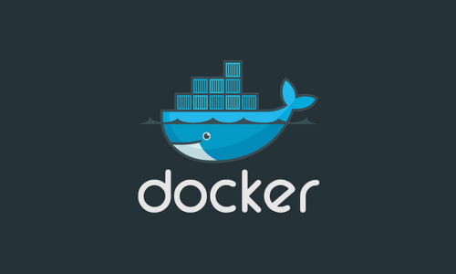
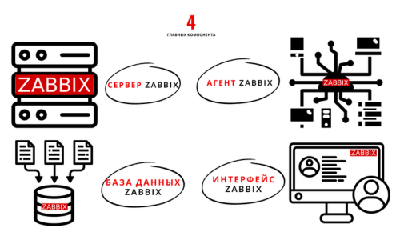

# Запускаем Zabbix. Переходим на контейнеры: быстрый старт, экономия ресурсов и крепкий сон


# Предисловие
Всем привет!  Меня зовут Сергей, я внедряю и сопровождаю мониторинг, вот уже пару лет. Написал “буклет”, где ты читатель найдешь вводную информацию о технологиях, и практический пример внедрения системы мониторинга Zabbix по типу “полный дом”. Можно запустить все компоненты или выбрать нужные, а можно запустить компоненты на разных машинах в кластере, и после запуска компоненты готовы к работе. Своей целью я поставил быстрое и простое внедрение мониторинга, с экономией ресурсов, и отказоустойчивостью, получилось или нет? Читай ниже 
# Оглавление <!-- omit in toc -->
<!-- TOC -->
- [Предисловие](#Предисловие)
- [Виртуализация](#Виртуализация)
- [Микрослужбы](#Микрослужбы)
- [Контейнеры](#Контейнеры)
- [Zabbix](#Zabbix)
- [Окружение](#Окружение)
    - [Установка Docker](#Установка-Docker)
- [Проект](#Установка-Docker)
- [Переменные окружения](#Переменные-окружения)
    - [База данных Zabbix](#База-данных-Zabbix)
    - [Система поиска Elasticsearch](#Система-поиска-Elasticsearch)
    - [Сервер Zabbix](#Сервер-Zabbix)
    - [Прокси-сервер Zabbix](#Прокси-сервер-Zabbix)
    - [Веб-сервер Zabbix](#Веб-сервер-Zabbix)
    - [Агент Zabbix](#Агент-Zabbix)
    - [Шлюз Java Zabbix](#Шлюз-Java-Zabbix)
    - [SNMP-ловушка Zabbix](#SNMP-ловушка-Zabbix)
    - [Веб-сервис Zabbix](#Веб-сервис-Zabbix)
    - [Прокси-сервер Nginx](#Прокси-сервер-Nginx)
    - [Панели визуализации](#Панели-визуализации)
- [Запускаем Zabbix](#Запускаем-Zabbix)
- [Прокси-сервер Zabbix](#Прокси-сервер-Zabbix)
- [Прокси-сервер Nginx](#Прокси-сервер-Nginx)
- [Elasticsearch](#Elasticsearch)
- [Kibana](#Kibana)
- [Grafana](#Grafana)
- [Запускаем кластер Zabbix](#Запускаем-кластер-Zabbix)
- [Итоги](#Итоги)
# Виртуализация
Начнем с технологии, которая сегодня везде, и она стандарт в построении производства. По виртуализации есть книги, статьи, и много информации в интернете, здесь я дам общее понимание. Технология виртуализации позволяет разделить и изолировать ресурсы компьютера, запуская виртуальные экземпляры машин управляемых гипервизором. Гипервизор - это программа которая управляем всеми вычислительными, сетевыми ресурсами и ресурсами хранения компьютера. Возможность разграничивать ресурсы компьютера, позволяет эффективнее использовать ресурс машины в производстве. У меня есть отдельная машина, там есть операционная система в которой работает база данных, и базе данных не нужны все мощности, она отлично работает с каким то своим условным набором, а остальные простаивают. Разделив ресурсы можно установить еще одну операционную систему, а внутри нее еще базу данных, веб-сервер и т.д. Исторически, сложилось 3 типа: полная, пара и контейнеризация. Полная и пара подойдут под пример выше, эти типы имеют свои детальные особенности, под свои условия, о них говорить не буду, больше о контейнеризации. Контейнеризация - представляет более легковесный и гибкий способ внедрения приложений, позволяет запускать изолированные контейнеры, как процессы на машине, используя систему и ее ядро. При общепринятом подходе для внедрения сервиса предоставляется отдельная машина, контейнеризация идет вперед и отходит от общепринятого подхода, переходя в изолированную структуру которую относят к микрослужбам.

# Микрослужбы


Что такое микрослужба? Это независимые развернутые службы, которые общаются между собой по сети, делают систему распределенной и нейтральной к технологиям. Громкое слово `“Независимая”` - это изолировать, развернуть, изменять без посторонней зависимости. `“Распределенная”` -  когда компоненты системы, разбросаны по сетевым адресам, общаются между собой и могут быть запущены на разных машинах. `“Нейтральность к технологиям”` - можно варьировать выбором технологий, стилями программирования, базы данных в поисках правильной схемы и т.д. ведь все запускается в изолированном контейнере. Перед нами открываются новые возможности по внедрению и сопровождению служб.

Если тебя, как и меня читатель двигают идеи о движении к передовому внедрению то книги: Сэм Ньюмен, `“От монолита к микросервисам”` и `“Ускоряйся. Наука DevOps”` от Джез Хамбл, Джин Ким будем отличным дополнительным источникам получения идей. Я не смогу в краткой форме изложить всю суть, вместо этого я попробую тебя "зацепить" :)

Сэм Ньюмен в книге `"От монолита к микросервисам"` пишет: `"Независимая природа развертываний открывает новые модели повышения масштаба и робастности систем, а также позволяет комбинировать и сочетать технологии"`. 
Создаем систему в изолированной среде, которую можно масштабировать, автоматизировать и сочетать технологии. А если я уже хочу это делать с чего начать? Сначала организационные преобразования, вот о каких пишет Сэм Ньюмен, цитата: `Трехъярусная архитектура универсальна и общепринята, она основана на способе организации наших групп разработки. Мы группируем людей на основе их стержневых компетенций, поэтому мы создаем IT-активы. Указанный факт объясняет почему трехъярусная архитектура распространена, она не плохая но она группирует людей вокруг дружеских отношений. Силы и стремления изменились, мы хотим осуществлять доставку софта гораздо быстрее, чем когда прежде, теперь объединяем людей в поликвалифицированные группы. Владельцы продуктов теперь работают непосредственно в рамках групп доставки, причем эти группы выравниваются на клиента, теперь норма существование любой центральной ИТ-функции заключается в поддержке групп доставки, ориентированных на клиента.` 

Сэм Ньюмен продолжает дальше: `Как продать микрослужбы своему боссу?` Цитата: “Восьмиступенчатый процесс Джона Коттера”. Отправляем в "путешествие" с автором и получаем 8 пунктов: 

- `Закрепление необходимости`
- `Создание направляющей коалиции`
- `Развитие видения и стратегии`
- `Коммуницирование видения перемен`
- `Расширение полномочий сотрудников`
- `Краткосрочные победы`
- `Сбор и концентрация дополнительных изменений`
- `Бросаем якорь, клич в новом подходе в культуре`

Профессор Коттер знает о чем говорит, управляя кафедрой в Гарвардской школе бизнеса. 

Иду дальше в книге `Ускоряйся. Наука DevOps` от Джез Хамбл, Джин Ким я познакомился с Законом Конвея: `Любая организация, которая строит дизайн системы, сделает дизайн, структуру которого является копией коммуникационной структуры организации.` Он дал мне более общие понимание движения и изменения, какая коммуникация внутри своей организации, такой дизайн системы или нет? Приглашаю тебя читатель сесть за хорошие книжки. 

Теперь о контейнерах.

# Контейнеры



Суть контейнерных технологий в создании изолированных сред для запуска служб и их зависимостей. Контейнер можно упаковать в файл вместе с его зависимостями, библиотеками и другими необходимыми компонентами, и запустить их в изолированном окружении. Разработчик Zabbix уже выпустили все что необходимо, для запуска мониторинга на контейнерных технологиях, их я буду использовать. Контейнерных технологий сегодня много, но благодаря платформе Docker процесс упаковки приложения, библиотек и файловой системы стал проще. Docker также позволяет переносить контейнеры на разные машины в виде пакета, где есть контейнерный движок. Конечно есть и другие, таблица по технологиям тебе в помощь. Внедрение и разработка контейнеров объединяет людей платформой, превращаясь в стандарт для разработки и сопровождения. Если не работал с платформой Docker, то рекомендую книгу "Docker на практике" от Эйдан Хобсон, Иан Милл, и документацию. Платформа представляет из себя клиент-серверное взаимодействие, где пользователь - это клиент, а сервер - демон Docker, клиент отправляет команды, а демон их выполняет. Общая структура взаимодействия такая: у меня есть Dockerfile - файл с инструкциями для создания изображения (Docker image), Docker Image - это файл(пакет), который и создаст наш контейнер, как файл (пакет) его можно хранить как локально так и удаленно в репозитории (regestry) Docker. Контейнер (containers) Docker - это готовый к запуску изолированный процесс(ы). C платформой и демоном можно работать удаленно, шифровано - взаимодействие по протоколу HTTP. У платформы есть инструменты которые я и буду использовать.Например Docker-Compose - это инструмент для определения и запуска много контейнерных Docker-служб. С помощью Docker-Compose ты можешь объединить несколько контейнеров в приложение, определить зависимости между контейнерами, настроить параметры контейнеров, а потом ими управлять как единым целым. Файл конфигурации Docker-Compose, обычно называемый docker-compose.yml или ompose.yml,содержит описание всех необходимых контейнеров, услуг, сетей и томов для запуска приложения, и позволяет определить различные параметры и настройки для каждого контейнера, такие как образы, порты, переменные окружения, сети и т. д. После создания файла конфигурации, ты можешь использовать команды Docker-Compose для управления своими много контейнерными приложениями, такими как запуск, остановка и перезапуск, масштабирование служб, просмотр журналов и тд. Это значительно упрощает управление и развертывание много контейнерных приложений, обеспечивая простой и однородный способ определения и управления контейнерами. Тут думаю все, теперь о мониторинге.

# Zabbix

Рекомендую книжку `"Zabbix. Практическое руководство"` Андреа Далле Вакке, как хороший старт, здесь я дам краткое описание, а более детальнее лучше открыть [документацию.](https://www.zabbix.com/documentation/6.0/ru/manual) 

Zabbix — это свободное программное обеспечение для мониторинга сети, серверов, виртуальных машин, приложений, сервисов, баз данных, облачных сред и т.д. 



ПО имеет клиент-серверную архитектуру, состоящая из компонентов: `Веб-интерфейса`, `сервера Zabbix`, `базы данных Zabbix`, `агента Zabbix`. Есть еще второстепенные компоненты, которые позволяют расширить мониторинг, а именно: `система поиска Elasticsearch`, `шлюз Java Zabbix`, `ловушка SNMP Zabbix`, `веб-сервис (отправка отчетов) Zabbix`. Сервер Zabbix отвечает за сбор, и анализ данных мониторинга. Агенты Zabbix которые устанавливаются на отслеживаемых устройствах передают данные о состоянии системы на сервер Zabbix. Это данные об использовании CPU, памяти, дисков, сетевой трафик, работа сервисов и процессов. Связь между агентом и сервером идет по протоколу TCP/IP, позволяет передавать разнообразные типы данных: числовые значения, текстовые значения, символьные значения и т.д. У протокола есть механизм шифрования и аутентификации а значит и данные будут идти целыми и конфиденциальными. Данные будем как передавать, так и хранить. База данных Zabbix - она будет хранить данные, по умолчанию у нас огромный выбор для своих условий, я буду использовать [расширение TimescaleDB](https://www.zabbix.com/documentation/current/ru/manual/installation/requirements) для PostgreSQL. За всеми данными удобно наблюдать и строить мониторинг из веб-интерфейса Zabbix. Шлюз Java Zabbix - это такая точка входа для данных по протоколу JMX, с сервера Java. SNMP-ловушка - это механизм, который используется для получения активных уведомлений и информации о событиях от устройств, поддерживающих протокол SNMP (Simple Network Management Protocol). Веб-сервис Zabbix - это процесс по отправке отчетов по расписанию через электронную почту, отчет представляет собой файл PDF. Остался еще один компонент - Zabbix-прокси, о котором будет ниже. Оповещение событий, имеет гибкий механизм, который можно настраивать на уведомления практически на любое событие. Например, задачу в Jira, сообщение через E-mail, сообщение в Telegram. Такой подход позволяет быстро получить информацию в канал связи и реагировать на проблемы. Всё остальные какие то детали можно узнать из книги `"Zabbix. Практическое руководство"` Андреа Далле Вакке, или в [документации](https://www.zabbix.com/documentation/6.0/ru/manual). С вводными технологиями и все, приступим к развертыванию, но сначала об окружении.

# Окружение

Машина 2 ядра и больше, 4 и более гигабайт оперативной памяти, 50 гигабайт свободного места на диске, и в моем случаи Oracle Linux (RHEL). Доступные порты для запуска сервисов, [можно найти здесь](https://www.zabbix.com/documentation/6.0/ru/manual/installation/requirements#%D1%81%D0%B5%D1%80%D0%B2%D0%B5%D1%80-%D0%BF%D1%80%D0%BE%D0%BA%D1%81%D0%B8). Системные компоненты обновлены до актуального состояния. Платформа Docker требует, чтобы машина была с актуальными обновлениями в [соответствии с ее документацией](https://docs.docker.com/). Поэтому смело обновляем систему и ее компоненты, а работать мы будем с платформой. При обновлении ядра системы в исключительных случаях платформа без сильна, но это редкие случаи. Для реализации нам нужен пользовать - администратор, root можно отключить, и быть в группе sudo. Настройка сети с внешним доступом, тут я использую сетевой мост, или сеть NAT. Брандмауэр и [SeLinux остается включенным](https://access.redhat.com/documentation/en-us/red_hat_enterprise_linux/8/html-single/using_selinux/index). По умолчанию в RedHat механизм SeLinux включен, и при настройке платформы Docker будут загружены политика SeLinux и брандмауэра, и этого достаточно, чтобы контролировать работу платформы, сетевого взаимодействия, не углубляясь в детали.

### Установка Docker

Docker позаботилась о своих новых пользователях и предлагает установку в одну команду:

```sh
curl https://get.docker.com | sh
```
У меня RHEL тут своими силами. Сделал файл [installdocker](images/micro.png), запускаем для установки. 

```sh
#!/bin/bash
dnf update
dnf install -y yum-utils
yum-config-manager --add-repo https://download.docker.com/linux/centos/docker-ce.repo
dnf install -y docker-ce docker-ce-cli containerd.io docker-buildx-plugin docker-compose-plugin
systemctl enable docker.service
systemctl start docker
docker version
docker compose version
exit
```

Ждем установку, как только на экране будет вывод версии платформы и инструмента - платформа и инструменты готовы. Команды для взаимодействия с платформой должны быть запущены привилегированным пользователем и тут можно внести своего пользователя в группу docker, и тогда при написании команд, не нужно будет писать sudo. После внесения своего пользователя в группу docker нужна перезагрузка машины. Вносим своего пользователя в группу docker:

```sh
sudo usermod -aG docker $user
```
`$user - твой пользователь`

Окружение готово, платформа установлена теперь переходим к проекту внедрения.
