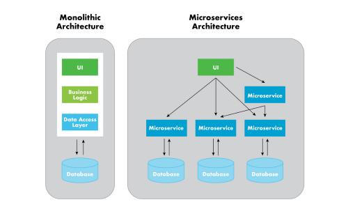

# Запускаем Zabbix. Переходим на контейнеры: быстрый старт, экономия ресурсов и крепкий сон

# Предисловие
Всем привет!  Меня зовут Сергей, я внедряю и сопровождаю мониторинг, вот уже пару лет. Написал “буклет”, где ты читатель найдешь вводную информацию о технологиях, и практический пример внедрения системы мониторинга Zabbix по типу “полный дом”. Можно запустить все компоненты или выбрать нужные, а можно запустить компоненты на разных машинах в кластере, и после запуска компоненты готовы к работе. Своей целью я поставил быстрое и простое внедрение мониторинга, с экономией ресурсов, и отказоустойчивостью, получилось или нет? Читай ниже 
# Оглавление <!-- omit in toc -->
<!-- TOC -->
- [Предисловие](#Предисловие)
- [Виртуализация](#Виртуализация)
- [Микрослужбы](#Микрослужбы)
- [Контейнеры](#Контейнеры)
- [Zabbix](#Zabbix)
- [Окружение](#Окружение)
    - [Установка Docker](#Установка-Docker)
- [Проект](#Установка-Docker)
- [Переменные окружения](#Переменные-окружения)
    - [База данных Zabbix](#База-данных-Zabbix)
    - [Система поиска Elasticsearch](#Система-поиска-Elasticsearch)
    - [Сервер Zabbix](#Сервер-Zabbix)
    - [Прокси-сервер Zabbix](#Прокси-сервер-Zabbix)
    - [Веб-сервер Zabbix](#Веб-сервер-Zabbix)
    - [Агент Zabbix](#Агент-Zabbix)
    - [Шлюз Java Zabbix](#Шлюз-Java-Zabbix)
    - [SNMP-ловушка Zabbix](#SNMP-ловушка-Zabbix)
    - [Веб-сервис Zabbix](#Веб-сервис-Zabbix)
    - [Прокси-сервер Nginx](#Прокси-сервер-Nginx)
    - [Панели визуализации](#Панели-визуализации)
- [Запускаем Zabbix](#Запускаем-Zabbix)
- [Прокси-сервер Zabbix](#Прокси-сервер-Zabbix)
- [Прокси-сервер Nginx](#Прокси-сервер-Nginx)
- [Elasticsearch](#Elasticsearch)
- [Kibana](#Kibana)
- [Grafana](#Grafana)
- [Запускаем кластер Zabbix](#Запускаем-кластер-Zabbix)
- [Итоги](#Итоги)
# Виртуализация
Начнем с технологии, которая сегодня везде, и она стандарт в построении производства. По виртуализации есть книги, статьи, и много информации в интернете, здесь я дам общее понимание. Технология виртуализации позволяет разделить и изолировать ресурсы компьютера, запуская виртуальные экземпляры машин управляемых гипервизором. Гипервизор - это программа которая управляем всеми вычислительными, сетевыми ресурсами и ресурсами хранения компьютера. Возможность разграничивать ресурсы компьютера, позволяет эффективнее использовать ресурс машины в производстве. У меня есть отдельная машина, там есть операционная система в которой работает база данных, и базе данных не нужны все мощности, она отлично работает с каким то своим условным набором, а остальные простаивают. Разделив ресурсы можно установить еще одну операционную систему, а внутри нее еще базу данных, веб-сервер и т.д. Исторически, сложилось 3 типа: полная, пара и контейнеризация. Полная и пара подойдут под пример выше, эти типы имеют свои детальные особенности, под свои условия, о них говорить не буду, больше о контейнеризации. Контейнеризация - представляет более легковесный и гибкий способ внедрения приложений, позволяет запускать изолированные контейнеры, как процессы на машине, используя систему и ее ядро. При общепринятом подходе для внедрения сервиса предоставляется отдельная машина, контейнеризация идет вперед и отходит от общепринятого подхода, переходя в изолированную структуру которую относят к микрослужбам.

# Микрослужбы

Что такое микрослужба? Это независимые развернутые службы, которые общаются между собой по сети, делают систему распределенной и нейтральной к технологиям. Громкое слово `“Независимая”` - это изолировать, развернуть, изменять без посторонней зависимости. `“Распределенная”` -  когда компоненты системы, разбросаны по сетевым адресам, общаются между собой и могут быть запущены на разных машинах. `“Нейтральность к технологиям”` - можно варьировать выбором технологий, стилями программирования, базы данных в поисках правильной схемы и т.д. ведь все запускается в изолированном контейнере. Перед нами открываются новые возможности по внедрению и сопровождению служб.

Если тебя, как и меня читатель двигают идеи о движении к передовому внедрению то книги: Сэм Ньюмен, `“От монолита к микросервисам”` и `“Ускоряйся. Наука DevOps”` от Джез Хамбл, Джин Ким будем отличным дополнительным источникам получения идей. Я не смогу в краткой форме изложить всю суть, вместо этого я попробую тебя "зацепить" :)

Сэм Ньюмен в книге `"От монолита к микросервисам"` пишет: `"Независимая природа развертываний открывает новые модели повышения масштаба и робастности систем, а также позволяет комбинировать и сочетать технологии"`. 
Создаем систему в изолированной среде, которую можно масштабировать, автоматизировать и сочетать технологии. А если я уже хочу это делать с чего начать? Сначала организационные преобразования, вот о каких пишет Сэм Ньюмен, цитата: `Трехъярусная архитектура универсальна и общепринята, она основана на способе организации наших групп разработки. Мы группируем людей на основе их стержневых компетенций, поэтому мы создаем IT-активы. Указанный факт объясняет почему трехъярусная архитектура распространена, она не плохая но она группирует людей вокруг дружеских отношений. Силы и стремления изменились, мы хотим осуществлять доставку софта гораздо быстрее, чем когда прежде, теперь объединяем людей в поликвалифицированные группы. Владельцы продуктов теперь работают непосредственно в рамках групп доставки, причем эти группы выравниваются на клиента, теперь норма существование любой центральной ИТ-функции заключается в поддержке групп доставки, ориентированных на клиента.` 

Сэм Ньюмен продолжает дальше: `Как продать микрослужбы своему боссу?` Цитата: “Восьмиступенчатый процесс Джона Коттера”. Отправляем в "путешествие" с автором и получаем 8 пунктов: 

- `Закрепление необходимости`
- `Создание направляющей коалиции`
- `Развитие видения и стратегии`
- `Коммуницирование видения перемен`
- `Расширение полномочий сотрудников`
- `Краткосрочные победы`
- `Сбор и концентрация дополнительных изменений`
- `Бросаем якорь, клич в новом подходе в культуре`

Профессор Коттер знает о чем говорит, управляя кафедрой в Гарвардской школе бизнеса. 

Иду дальше в книге `Ускоряйся. Наука DevOps` от Джез Хамбл, Джин Ким я познакомился с Законом Конвея: `Любая организация, которая строит дизайн системы, сделает дизайн, структуру которого является копией коммуникационной структуры организации.` Он дал мне более общие понимание движения и изменения, какая коммуникация внутри своей организации, такой дизайн системы или нет? Приглашаю тебя читатель сесть за хорошие книжки. 

Теперь о контейнерах.
